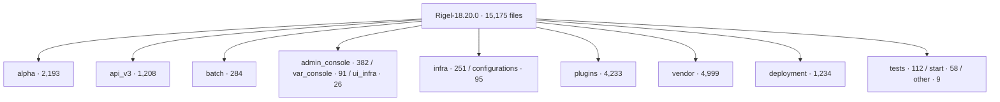

# Rigel 18.20.0 source graph

## Shared MCP project

Use **`kaltura-rigel-18.20.0-full`**, not the packaging repository's graph and
not the initial `kaltura-rigel-18.20.0-upstream` index (which omitted vendor and
other ignored directories). This project is available through the existing
local `codebase-memory-mcp` server used by Codex, Claude and Grok.

Generation: **2026-09-25T12:19:00Z**, full mode, CLI version 0.10.8.
Graph snapshot: **231,336 nodes / 800,641 edges / 14,227 file nodes**.
These are parser-generated structures and candidate relationships, not proven
runtime call counts or a compatibility result.

Source identity: `Rigel-18.20.0.zip`, SHA-256
`58d534d09b3b75c9a8333957268c884f79032638b2d44a278b1992fda1b0ab28`.

Local trees under `/home/nilton/Projetos/nilton/NOVOS/kaltura-rigel-18.20.0-source/`:

- `server-Rigel-18.20.0/`: exact extracted archive, every file byte-verified.
- `graph-view/`: analysis copy; application source bytes remain identical.
  Only four `.gitignore` files were neutralized, `.cbmignore` added to include
  normally skipped directories, and `.codebase-memory.json` added to recognize
  `.phtml`, `.inc`, `.php5` as PHP. These changes are **not application patches**
  and must not be included in the experimental source ZIP.

The graph is the **unpatched upstream**, not the packaged payload and not the
PHP 8.3 experiment. Consult source-to-package overlay evidence separately.

## Complete file inventory versus best-effort graph

[File inventory](evidence/source-graph/file-inventory.csv) records every one of
**15,175 archive files** with path, size, SHA-256 and graph membership category:

| Category | Original files |
|---|---:|
| File node, no recorded partial parse | 13,492 |
| File node, partial parsing | 734 |
| Excluded by built-in suffix rules (primarily binary assets/fonts) | 519 |
| No file node (other unsupported/text/metadata/resource files) | 430 |

The additional graph file node is the analysis-only `.codebase-memory.json`.
No original file is absent from the inventory, but **the graph does not model
all content or all relationships**. In particular, old PHP syntax produces
partial parses in some libraries central to this migration.

Coverage was checked for every one of the 14,227 file nodes, and all 1,253
scope coverage entries were paginated. Metadata freshness matched throughout.
No recorded issue is not proof of complete parsing. `index_status` caps its
inline lists; use the complete [coverage export](evidence/source-graph/coverage.json)
rather than counting only that response's examples.

## Directory map (not runtime call flow)



These directory counts come from the archive, not inferred activity: historical,
generator, optional and currently exercised paths still need classification.

## Claude / Grok query recipe

Always pass the project explicitly, since the server hosts many projects.

```json
{"project":"kaltura-rigel-18.20.0-full","name_pattern":"Zend_Registry","limit":10}
```

Send that to `search_graph`, then use its exact qualified symbol for `trace_path`
and `get_code_snippet`. Before relying on a file, use `check_index_coverage`:

```json
{"project":"kaltura-rigel-18.20.0-full","paths":["vendor/ZendFramework/library/Zend/Registry.php"]}
```

For a broader view use `get_architecture` with `aspects:["overview"]`; use
`query_graph` to inspect selected relationships rather than dumping the graph.
The same server is accessible without a native MCP client:

```sh
codebase-memory-mcp cli search_graph '{"project":"kaltura-rigel-18.20.0-full","name_pattern":"Zend_Registry","limit":10}'
```

For partial/missing coverage, read the reported source ranges directly. Never
infer dead code, absence of callers or complete impact from this graph alone.
Zend JSON Encoder/Decoder and Services_JSON specifically need direct-source
fallback because their legacy syntax disrupts parsing. The directory map and
[architecture export](evidence/source-graph/architecture.txt) are starting points,
not a substitute for verified traces.

## Rebuild and audit

The archive and raw tree remain immutable. Recreate a separate analysis copy,
neutralize only its `.gitignore` metadata, and apply these local indexing files:

`.cbmignore`:

```gitignore
!*/
!**/
!**
```

`.codebase-memory.json`:

```json
{"extra_extensions":{".phtml":"php",".inc":"php",".php5":"php"}}
```

Run `index_repository` with the analysis root, the explicit project above and
`mode:"full"`. Then refresh `index_status`, paginate root scope coverage, export
`MATCH (f:File) RETURN f.file_path LIMIT 20000`, and regenerate the CSV/summary:

```sh
python3 tools/php83/inventory-source-graph.py ARCHIVE RAW_TREE GRAPH_VIEW FILE_TABLE doc/php83/evidence/source-graph
```

The generator verifies the archive checksum and exact original bytes, rejecting
unexpected application-source differences in the analysis copy. It does not
claim to restore original UNIX permissions from the ZIP.

Index configuration references: [ignore precedence](https://github.com/DeusData/codebase-memory-mcp/blob/main/docs/cbmignore.md)
and [custom extension mapping](https://github.com/DeusData/codebase-memory-mcp/blob/main/docs/CONFIGURATION.md).

## Cross-agent verification

Claude CLI and Grok CLI independently called the read-only MCP search/coverage
tools and confirmed this exact project is visible. Both found `Zend_Registry`
in `vendor/ZendFramework/library/Zend/Registry.php:30-209`, with matching metadata
freshness and no recorded parse gap for that file. Their answers explicitly
retain best-effort limitations; neither treated graph degrees as complete caller
counts or PHP 8.3 acceptance.

Claude's first attempt was blocked by its plan-mode tool policy; retrying with
only the intended read tools allowed succeeded. One extra `list_projects` call
was denied by the narrow allowlist, but the requested search and coverage calls
succeeded. No persistent CLI configuration or application source was changed to
provide this access. Grok used its already configured MCP server.
