# Architecture and source map

[Operations](operations.md) · [HTTP API](api.md) · [Development and delivery](development.md)

## Runtime boundaries

Kaltura Console is a Linux Go executable with an embedded Vue application. It manages **one configured Kaltura partner**; local console accounts are not Kaltura users. Kaltura remains the source of truth for media, renditions, conversion, and delivery. The console does not transcode video or connect to the Kaltura database.



[Open the interactive architecture diagram](diagrams/architecture.html) (dark/light theme, SVG/raster export).

```text
Browser → optional HTTPS reverse proxy → Go HTTP server → Kaltura api_v3
                                              ├────────→ Kaltura media delivery
                                              ├────────→ console SQLite OR MariaDB
                                              └────────→ private upload staging directory
```

Vue, Tailwind and local Inter fonts are compiled by Vite into `web/dist`; `web/web.go` embeds that tree. Node and a separate frontend server are unnecessary in production. `cmd/serve.go` constructs the Kaltura client, auth service and Echo v5 handlers. HTTP and UI use the same origin. A canonical `server.base_path` mounts all routes beneath a prefix such as `/console`; the default empty prefix preserves root deployment. Vite emits relative assets, the server injects a matching HTML base, and the router/API helpers consume that base, so the same build supports either deployment. API errors are JSON; unknown API paths are not rewritten to the SPA.

## Source navigation

Paths below are relative to `kaltura-console/`.

| Path | Responsibility |
|---|---|
| `main.go`, `cmd/root.go` | CLI entry point; config, migrations and local-account commands |
| `cmd/serve.go` | Dependency wiring, listener, structured logging, shutdown, periodic expiry cleanup |
| `internal/tlsconfig/tls.go` | Explicit TLS pair loading or persistent self-signed generation/reuse; startup validity checks |
| `internal/config/config.go` | Viper defaults, TOML/environment loading and validation |
| `internal/config/example.toml`, `config.toml.example` | Identical embedded/public example configuration |
| `internal/models/models.go` | Users, sessions and failed-login records |
| `internal/database/database.go` | GORM drivers, connection pool and versioned migrations |
| `internal/auth/auth.go` | Password hashes, lockout, session expiry/revocation and last-admin protection |
| `internal/server/server.go` | Actual route registry and shared middleware; handlers are in this package |
| `internal/server/auth.go` | Cookie/CSRF/origin checks, login/session/user HTTP handlers |
| `internal/server/media.go` | Dashboard, list/detail/status/flavors, mutations and health checks |
| `internal/server/upload.go` | Bounded multipart intake, disk staging and file validation |
| `internal/server/proxy.go` | Authenticated thumbnail/MP4 proxy, ownership check and redirect allowlist |
| `internal/server/spa.go` | Embedded static assets, history fallback and login redirect |
| `internal/kaltura/client.go` | Form-based API transport, KS cache and single session-error retry |
| `internal/kaltura/upload.go` | Create entry/token, stream upload, attach content, failure cleanup |
| `internal/kaltura/media.go`, `status.go` | Typed API objects, delivery URLs and status mappings |
| `frontend/src/main.ts`, `session.ts`, `api.ts`, `base.ts` | UI routes, Pinia session state, fetch/errors and safe return URLs |
| `frontend/src/views/` | Login, dashboard, library, upload, detail, users and diagnostics screens |
| `frontend/src/style.css` | Theme/layout; square-corner design enforced by frontend lint |
| `web/web.go`, `web/dist/` | Embedded production assets; generated assets rebuilt before Go compilation |
| `packaging/`, `init/systemd/` | nFPM package manifest, lifecycle scripts and hardened service unit |
| `tests/e2e.py`, `tests/e2e.sh` | Browser-driven live-server acceptance scenario |

## Authentication and trust

Passwords use bcrypt (cost 12); users have `admin` or `viewer` roles. Both can read media and diagnostics; only admins can upload, edit/delete media or administer accounts. Backend middleware enforces roles independently of UI visibility.

Sessions use random opaque identifiers stored in the console database and an HttpOnly, SameSite=Lax cookie. Normal sessions default to 2 hours idle / 12 hours absolute; remembered sessions have a 30-day absolute lifetime without the idle check. Each session has a CSRF token; authenticated mutations require `X-CSRF-Token`. Mutations with a supplied cross-origin `Origin` are rejected, including login. Role/password changes and account deletion revoke sessions. Transactions serialize account edits before checking the last-admin invariant.

TLS determines the cookie's Secure flag; its Path is the application prefix or `/`. A prefix change does not revoke or migrate existing sessions/cookies. Forwarded client IP/protocol are trusted only for configured proxy CIDRs; the default list is empty. Never expose an HTTP installation as if it provided transport confidentiality. JSON/API and proxied-media responses use `private, no-store`.

Kaltura's admin secret and KS stay server-side. KS caching is protected by a mutex and requests retry once on recognized expired/invalid KS errors. This is not a general retry of arbitrary upstream failures. Request logging records paths, not query strings or request bodies; operators should still treat logs as sensitive because account identifiers can appear. Kaltura API exceptions are logged by error code rather than the upstream message, which might echo sensitive values.

## Listener TLS

`cmd/serve.go` uses `internal/tlsconfig` for standalone HTTPS. Operator certificate/key paths take precedence over fallback generation. If both paths are empty, a ten-year self-signed ECDSA pair is generated once beneath `server.tls_dir`, then reused. Unsafe/partial fallback material and invalid/expired certificates stop startup; identity is not silently renewed. Certificate rotation is an operator action followed by restart. The fallback private key is 0600. The listener configuration does not disable outbound Kaltura certificate verification.

The diagrams show logical components and root-relative request names; a configured prefix applies to all illustrated HTTP paths. Native HTTPS runs in the Go process instead of the optional HTTPS edge shown. See [operations](operations.md#standalone-https) for production CA guidance and the prefix-preserving Apache example.

## Upload and playback


[Open the interactive upload sequence](diagrams/upload.html). Browser uploads are **staged on disk**, not held in a whole-file memory buffer and not forwarded directly as they arrive. After intake/validation the Kaltura client streams the staged file through `io.Pipe` into multipart `uploadToken.upload`. Reopening the file permits a KS retry. The writer goroutine is joined even after an early upstream response.

The upload sequence is `media.add → uploadToken.add → uploadToken.upload → media.addContent`. Later failures trigger best-effort deletion of the newly created entry using a fresh bounded context. Cleanup can fail during an outage; inspect Kaltura for orphaned entries. Local staging files are removed on completion/failure, and startup removes matching abandoned files older than one hour. Do not share the staging directory between independent server instances.

Intake checks extension, a minimal ISO-BMFF `ftyp` header, name/description lengths, free disk and concurrency. This is not a full codec validation or malware scan. A minimum-free-space threshold is checked at admission, not a reservation for the complete incoming file. Budget disk for all concurrent uploads plus headroom.

Playback/thumbnail URLs exposed to the browser are local `/media/...` paths. The proxy validates entry ownership against the configured partner (cached for one minute), follows only HTTP(S) targets on configured host:port allowlists, and strips browser credentials. Streams relay Range/If-Range and relevant response headers, supporting 200/206/416 and HEAD. This is progressive MP4 delivery, not an HLS manifest-rewriting service. The host allowlist is not DNS pinning: secure DNS and network egress remain operational boundaries.

## Persistence and lifecycle

The console database contains `users`, `sessions`, `login_attempts`, and migration bookkeeping, not video records. SQLite uses the pure-Go glebarez driver, WAL, foreign keys, a 5-second busy timeout and a single open connection per process. MariaDB uses the MySQL GORM driver with a bounded connection pool. These are alternatives for console state; neither grants access to Kaltura's SQL schema.

CLI database operations and `serve` apply pending gormigrate migrations before use. Session/attempt cleanup runs every 15 minutes in the serving process. SIGINT/SIGTERM initiate a 30-second graceful shutdown, then force-close if needed. Long uploads can therefore be interrupted during an upgrade; schedule maintenance accordingly.

## References and verification scope

- [Validated Kaltura 18.20 API notes](../../doc/kaltura-api-noble.md).
- [OpenSpec proposal, design and tasks](../../openspec/changes/archive/2026-09-25-add-kaltura-console-go/).
- [Console README](../README.md) and [release history](../CHANGELOG.md).
- Owner's local reference projects: `go-ispconfig` for operational Go patterns; `painel-golang/frontend/src/skins/criarenet` and its `docs/prints` for visual reference. These are separate repositories, not runtime dependencies.

These descriptions reflect source behavior, not a claim that every deployment combination has passed acceptance tests. See [development](development.md#validation-evidence) for evidence and remaining environment checks.
